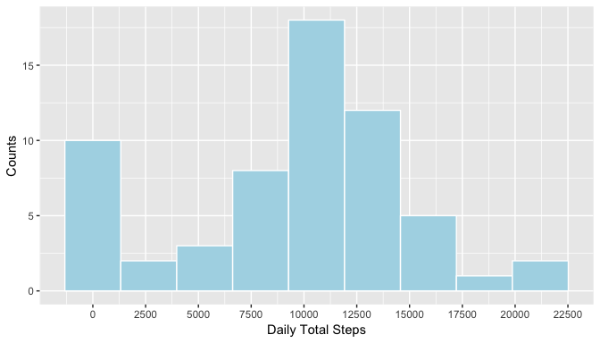
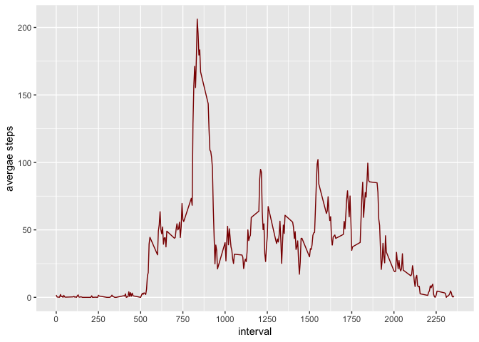
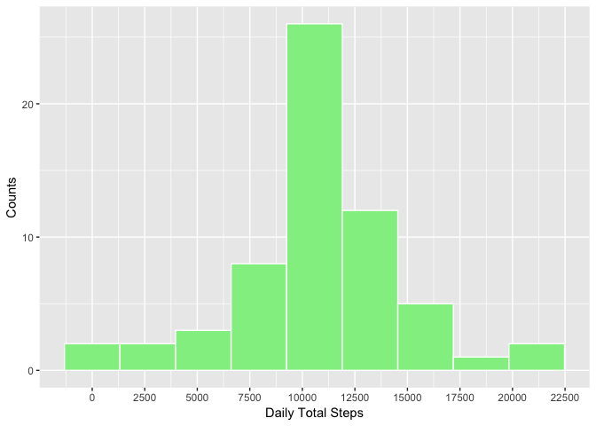
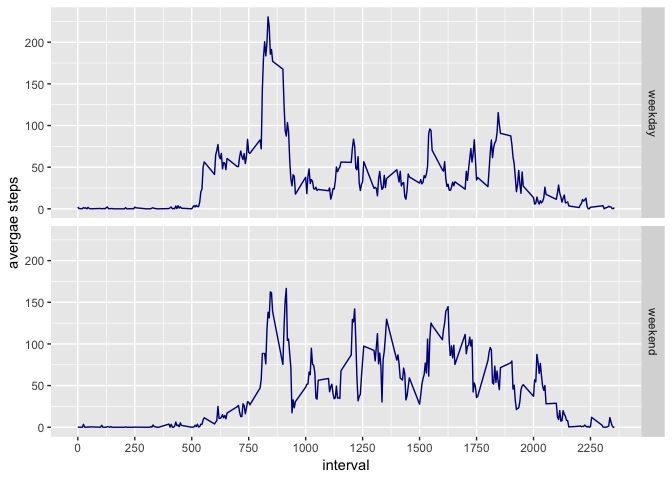

#### Dataset and packages are loaded 


```r
acts <- read.csv("activity.csv")
library(ggplot2)
```

### Total number of steps taken per day is shown below


```r
sumByDay <- tapply(acts$steps, acts$date, sum, na.rm = TRUE)
g1 <- ggplot(as.data.frame(sumByDay), aes(x = sumByDay)) 
g1 + geom_histogram(color = "white",fill= "lightblue", bins = 9) + scale_x_continuous(breaks = seq(0,22500, 2500)) + labs(x = "Daily Total Steps", y = "Counts") 
```

<!-- -->

```r
m1 <- mean(sumByDay)
m2 <- median(sumByDay)
```

#### The mean of total number of steps taken per day is 9354.2295082 steps, and its median is 10395 steps.

### Average daily activity pattern is shown below


```r
meanByInterval <- tapply(acts$steps, acts$interval, mean, na.rm = TRUE)
meanByInterval <- cbind(unique(acts$interval), meanByInterval)
colnames(meanByInterval) <- c("interval", "mean")
meanByInterval <- as.data.frame(meanByInterval)
g2 <- ggplot(meanByInterval, aes(x = interval, y = mean))
g2 + geom_line(color = "darkred") + scale_x_continuous(breaks =seq(0,2500,250)) +labs(y = "avergae steps")
```

<!-- -->


```r
maxStep <- meanByInterval[which.max(meanByInterval[,2]),1]
```
#### During the 835 interval, on average across all the days in the dataset, contains the maximum number of steps.


### Next, the number of missing values(NAs) in the dataset is calculated, and then they are imputed with the mean for that 5-minute interval.


```r
numNA <- sum(is.na(acts$steps))
```
#### There are 2304 missing values in this dataset!

The following code shows howthe NAs in the dataset are replaced with the 5-min interval mean value.

```r
acts2 <- acts     # create a new df, whose NAs will be imputed
for (i in 1:nrow(acts2)) {
    if (is.na(acts2[i,1])) {
        interval = acts2[i,3]
        acts2[i,1] <- meanByInterval[meanByInterval$interval == interval,][2]
        rm(interval)
    }
}
```

Total number of steps taken per day is shown below


```r
sumByDay2 <- tapply(acts2$steps, acts2$date, sum)
g1 <- ggplot(as.data.frame(sumByDay2), aes(x = sumByDay2)) 
g1 + geom_histogram(color = "white",fill= "lightgreen", bins = 9) + scale_x_continuous(breaks = seq(0,22500, 2500)) + labs(x = "Daily Total Steps", y = "Counts") 
```

<!-- -->

```r
m3 <- mean(sumByDay2)
m4 <- median(sumByDay2)
```
#### The mean of total number of steps taken per day is 1.0766189\times 10^{4} steps, and its median is 1.0766189\times 10^{4} steps.

### Differences in activity patterns between weekdays and weekends are explored below.


```r
# create a col in the dataframe, showing whether it's weekday or weekend
acts2$date <- as.Date(acts2$date)
acts2$weekday <- weekdays(acts2$date) 
weekday2 <-c()
for (i in 1: nrow(acts2)){
    if (acts2$weekday[i] == "Saturday" | acts2$weekday[i] == "Sunday"){
        weekday2[i] <- "Weekend"
    }else{
        weekday2[i] <- "Weekday"
    }
}
acts2$weekday2 <- weekday2   

# subsetting the dataset depending on whether it's weekday or weekend
weekdaySub <- subset(acts2, weekday2 == "Weekday")
weekendSub <- subset(acts2, weekday2 == "Weekend")

# calculate WEEKDAY mean value of each interval
meanByIntervalWeekday <- tapply(weekdaySub$steps, weekdaySub$interval, mean, na.rm = TRUE)
meanByIntervalWeekday <- cbind(unique(weekdaySub$interval), meanByIntervalWeekday)
meanByIntervalWeekday <- as.data.frame(meanByIntervalWeekday)
factor <- rep("weekday", nrow(meanByIntervalWeekday))
meanByIntervalWeekday <- cbind(meanByIntervalWeekday, factor)
colnames(meanByIntervalWeekday) <- c("interval", "meanByInterval", "weekday")

# calculate WEEKEND mean value of each interval
meanByIntervalWeekend <- tapply(weekendSub$steps, weekendSub$interval, mean, na.rm = TRUE)
meanByIntervalWeekend <- cbind(unique(weekendSub$interval), meanByIntervalWeekend)
meanByIntervalWeekend <- as.data.frame(meanByIntervalWeekend)
factor <- rep("weekend", nrow(meanByIntervalWeekend))
meanByIntervalWeekend <- cbind(meanByIntervalWeekend, factor)
colnames(meanByIntervalWeekend) <- c("interval", "meanByInterval", "weekday")

# Combine these two dataframe using 'rbind'
meanByInterval2 <- rbind(meanByIntervalWeekday, meanByIntervalWeekend)

# plotting in one column, two rows.
g3 <- ggplot(meanByInterval2, aes(x = interval, y = meanByInterval))
g3 + geom_line(color = "darkblue") + scale_x_continuous(breaks =seq(0,2500,250)) +labs(y = "avergae steps") + facet_grid(weekday~.)
```

<!-- -->


